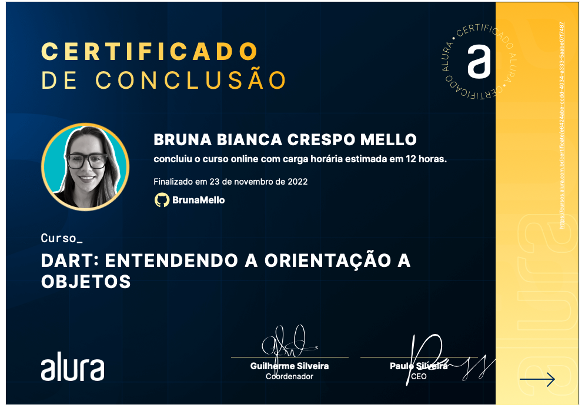

Take this Flutter course and:
- Understand what the Object Orientation paradigm is and how it works in the Dart language
- Learn to program using functions and scope
- Gain agility and avoid repeating the same code several times
- Create complex objects with more than one variable
- Represent real-world things with the Object Orientation paradigm
- Learn about the importance of using concepts of inheritance, polymorphism and abstract class
- Create your first class with Dart
- Improve your practice in day-to-day work by knowing theoretical points of O.O.

Course Finished:

Certificate link: https://cursos.alura.com.br/certificate/e6424abe-ccdd-4034-a333-5aabe07f7487

